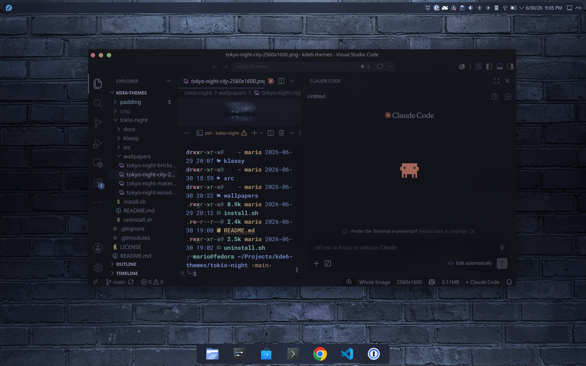

# Tokyo Night (macOS) — KDE Plasma 6 global theme

A complete, self-contained global theme for KDE Plasma 6 that pairs the **Tokyo Night**
color palette (the *Night* variant, matching the VSCode theme) with a **macOS-style**
desktop: a top panel with a full-screen Application Dashboard launcher, a global menu,
system tray and clock, and a bottom icon dock.

The theme is **self-contained** — it ships its own recolored copies of every visual
component and does not depend on other installed themes or extra plasmoids.



## What's included

- **Color scheme** — `Tokyo Night` (static; does not change with the wallpaper).
- **Plasma desktop theme** — `Tokyo Night` with translucent panels (panels, popups,
  tooltips, system tray).
- **Window decoration** — the **Klassy** decoration with the bundled `klassy/TokyoNight.klpw`
  preset: small circular traffic-light buttons in the Tokyo Night palette, on the left
  (macOS style). Klassy is an external prerequisite.
- **Look & Feel package** — `Tokyo Night (macOS)`, which also carries the **blur**,
  **transparency** and **panel layout**, so applying the theme applies all of it.
- **Konsole color scheme** — `Tokyo Night`, the Tokyo Night terminal ANSI palette with a
  subtly translucent, blurred background to match the desktop. The installer points your
  default Konsole profile at it; reopen Konsole windows to see it.
- **Albert launcher** — a macOS Spotlight-style launcher, installed by `install.sh` and added
  to the KDE autostart. Albert comes from a **non-official** repo; see
  [docs/PREREQUISITES.md](docs/PREREQUISITES.md).
- **Chrome theme** — `chrome/tokyo-night/`, a colors-only Google Chrome / Chromium theme in
  the same palette. Installed manually (see below), not by `install.sh`.

## How the panels work (no extra plasmoid required)

The panels are native Plasma panels: their **color** comes from the Tokyo Night Plasma
theme, their **transparency** from that theme's translucent panel background, and their
**blur** from a KWin blur effect. The bottom dock uses Plasma's native floating panel.

## Prerequisites

The theme needs the **Klassy** window decoration (for the macOS traffic-light buttons and the
corners that match the blur) and a KWin blur effect — **Better Blur DX** (the stock KWin Blur
also works). See [docs/PREREQUISITES.md](docs/PREREQUISITES.md). Without the blur, panels stay
translucent but unblurred; without Klassy, the window buttons/corners won't be the macOS style.

## Installation

```sh
./install.sh             # install everything and apply
./install.sh --no-apply  # copy assets without applying
./install.sh --uninstall # revert to a Breeze baseline and remove assets
./install.sh --help
```

`install.sh` backs up your live `kdeglobals`, `kwinrc`, panel and splash config (and your
default Konsole profile) to `~/.local/share/tokio-night-backups/<timestamp>/` before applying.

## Chrome theme

To style Chrome / Chromium in the same palette:

1. Open `chrome://extensions` and enable **Developer mode** (top right).
2. Click **Load unpacked** and select the `tokio-night/chrome/tokyo-night/` directory.
3. The theme applies immediately.

To remove it, go to `chrome://settings/appearance` and click **Reset to default**
(or remove the extension from `chrome://extensions`).

## Uninstall

```sh
./uninstall.sh
```

Restores a Breeze baseline and removes the installed Tokyo Night assets. Log out and back
in if a panel still looks stale.
